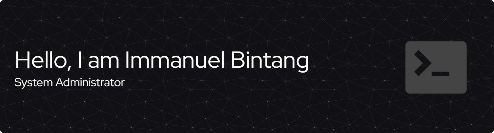

<!-- Hello, I'm Immanuel Bintang! -->

> Cloud & Infrastructure Enthusiast | Growing in Site Reliability & Security Practices
---

<!---My GitHub contributions summary---> 

---

### Technologies - Tools

  

  

---

### Highlighted Repository

- [**Shell Scripting Collection**](https://github.com/immanuelbint/shell-scripting)  
  A collection of shell scripts for automating various Linux system tasks. Each script is built to be portable, readable, and (mostly) POSIX compliant. Perfect for system admins, learners, or CLI fans.

- [**AWS Cloud Labs – Homelab Project**](https://github.com/immanuelbint/aws-cloud-labs)  
  AWS overview, hands-on labs, and mini-projects aimed at building my skills in AWS and cloud engineering.
  The main goal of this repository is to document my hands-on learning process, keep track of scripts, configurations, and insights gained while practicing AWS services and DevOps-related tasks.

- [**Immanuelbint Docs**](https://github.com/immanuelbint/immanuelbint.github.io)  
  My personal documentation site built with VitePress. Focused on DevOps, System Administration, Infrastructure, and CLI practices.

- [**Odoo Docker CI**](https://github.com/immanuelbint/odoo-docker-ci)  
  Practice project deploying Odoo with Docker and CI/CD.

---

### Connect with Me

